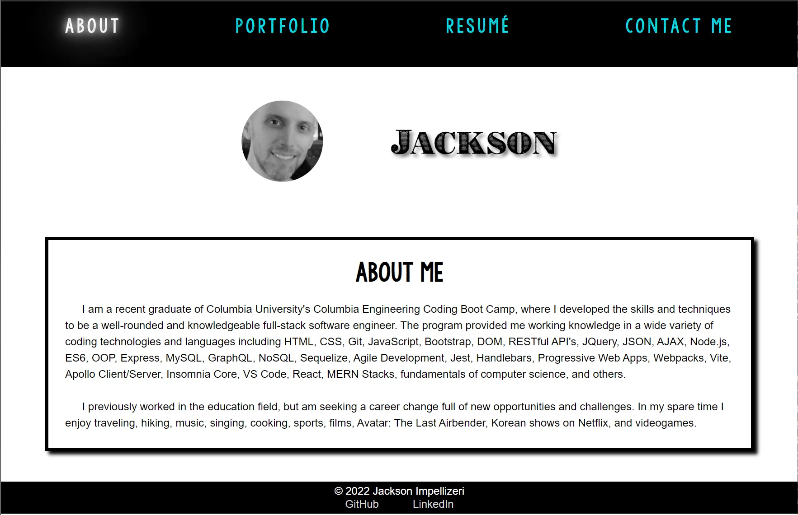

# React Portfolio

https://jaxpi.github.io/react-portfolio/
  

## Description

This is a professional portfolio developed using React in order to create a dynamically responsive user interface without reducing page and function speed. All of the creator's information is available on demand.

## Installation

There is no installation for this app, simply view it in the browser.

## Usage

A visitor to the site will be greeted with the creator's "About Me" page - containing information about the creator and the purpose of the site. By utilizing the navigation links on the top of the page the visitor can see the creator's resume, including a link to a pdf version for downloading/printing, a portfolio of the creator's projects and applications, including links to their deployed sites and their GitHub repositories, and a contact page where the visitor can enter their name, email address, and a message to submit to the creator who can then receive it and respond if necessary.

## License

MIT License

Copyright (c) 2022 Jackson Impellizeri

Permission is hereby granted, free of charge, to any person obtaining a copy
of this software and associated documentation files (the "Software"), to deal
in the Software without restriction, including without limitation the rights
to use, copy, modify, merge, publish, distribute, sublicense, and/or sell
copies of the Software, and to permit persons to whom the Software is
furnished to do so, subject to the following conditions:

The above copyright notice and this permission notice shall be included in all
copies or substantial portions of the Software.

THE SOFTWARE IS PROVIDED "AS IS", WITHOUT WARRANTY OF ANY KIND, EXPRESS OR
IMPLIED, INCLUDING BUT NOT LIMITED TO THE WARRANTIES OF MERCHANTABILITY,
FITNESS FOR A PARTICULAR PURPOSE AND NONINFRINGEMENT. IN NO EVENT SHALL THE
AUTHORS OR COPYRIGHT HOLDERS BE LIABLE FOR ANY CLAIM, DAMAGES OR OTHER
LIABILITY, WHETHER IN AN ACTION OF CONTRACT, TORT OR OTHERWISE, ARISING FROM,
OUT OF OR IN CONNECTION WITH THE SOFTWARE OR THE USE OR OTHER DEALINGS IN THE
SOFTWARE.
